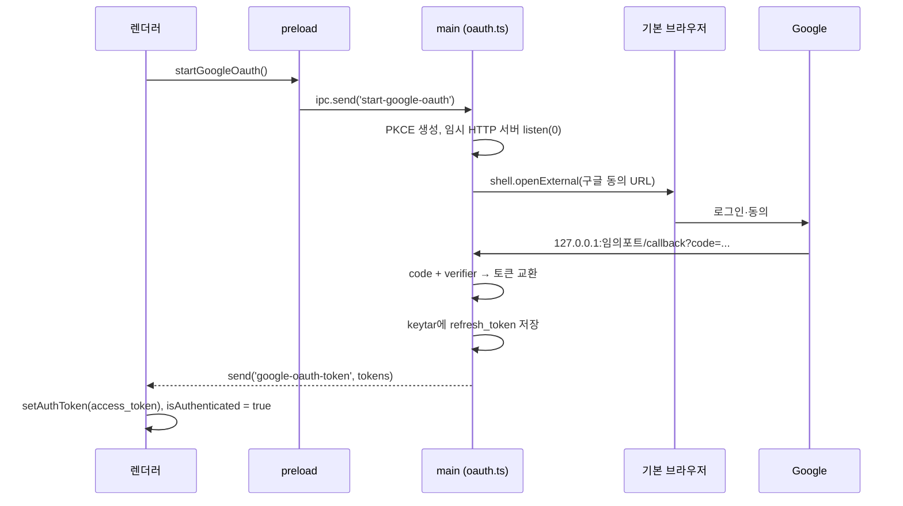

# 로그인 구조 현황 (리뉴얼 전 기준)

> 기준 커밋: `714b407` / 작성일 2026-09-10
> 목적: 로그인 구조를 리뉴얼하기 전에 **지금 어떻게 동작하는지**와 **지금 구조의 문제**를 정리한다.

## 1. 한눈에 보기

로그인은 Google OAuth 2.0 PKCE + 루프백 리다이렉트 방식이고, 5개 파일에 걸쳐 있다.

| 파일 | 역할 |
| --- | --- |
| `src/main/oauth.ts` | OAuth 전 과정. 임시 HTTP 서버, 토큰 교환, refresh token을 keytar에 보관 |
| `src/main/ipcHandler.ts` (12–14행) | IPC 핸들러 3개 등록 |
| `src/preload/index.ts` | 렌더러에 노출하는 API 5개 |
| `src/renderer/shared/hooks/useLogin.tsx` | 렌더러의 인증 상태 + IPC 리스너 (64줄) |
| `src/renderer/shared/lib/http.ts` | access token 보관 + 모든 API 요청에 주입 + 401 재발급 |

**토큰이 사는 곳**

| 토큰 | 위치 | 수명 |
| --- | --- | --- |
| refresh token | OS 자격 증명 저장소 (keytar, `Mirinae` / `google-refresh-token`) | 영구 |
| access token | **렌더러 프로세스 메모리** (`http.ts:1`의 모듈 변수 `authToken`) | 프로세스 수명 |
| 인증 여부(boolean) | **렌더러 React state — `useLogin`을 호출한 컴포넌트마다 한 벌씩** | 컴포넌트 수명 |

마지막 줄이 이 문서 문제 목록의 절반을 만든다.

## 2. 흐름

### 2-1. 최초 로그인



핵심: **access token이 IPC를 건너 렌더러로 넘어온다.**

### 2-2. 앱 재시작 (자동 로그인)

`useLogin`의 `useEffect`가 마운트 시 `refreshToken()` 호출 → `try-auto-login` invoke → main이 keytar에서 refresh token을 읽어 재발급 → access token을 렌더러로 반환.

### 2-3. access token 만료

만료 시각을 추적하지 않는다. **401을 받아야 비로소** 갱신한다 (`http.ts:33-47`).

```
요청 → 401 → window.api.refreshToken() → 성공하면 같은 요청 1회 재시도
                                        → 실패하면 setAuthToken(null) + window.dispatchEvent('auth-expired')
```

`auth-expired`는 전역 DOM 커스텀 이벤트다. `http.ts`(모듈 변수 세계)와 `useLogin`(React 세계)을 잇는 유일한 통로.

### 2-4. 로그아웃

`useLogin.logout()` → 자기 인스턴스 state를 false로 + `setAuthToken(null)` + `logout-google-oauth` invoke(keytar 삭제) + PostHog `user_logged_out`.

## 3. IPC 채널

| 채널 | 방향 | main 함수 | preload 이름 |
| --- | --- | --- | --- |
| `start-google-oauth` | R→M (send) | `startGoogleOAuth` | `startGoogleOauth` |
| `google-oauth-token` | M→R (send) | — | `onGoogleOauthSuccess` |
| `google-oauth-error` | M→R (send) | — | `onGoogleOauthError` |
| `try-auto-login` | R→M (invoke) | `tryAutoLogin` | `refreshToken` |
| `logout-google-oauth` | R→M (invoke) | `logoutGoogleOAuth` | `logoutGoogleOAuth` |

## 4. `useLogin` 소비자

| 호출처 | 쓰는 값 |
| --- | --- |
| `features/user/ui/LoginButton.tsx:4` | `login`, `logout`, `isAuthenticated` |
| `widgets/Calendar/ui/ScheduleModal.tsx:13` | `isAuthenticated`, `login` |
| `entities/event/hooks/useEvent.tsx:6` (`useEvents`) | `isAuthenticated` |
| `entities/event/hooks/useEvent.tsx:14` (`useHolidayEvents`) | `isAuthenticated` |

---

# 지금 구조의 문제

## A. 상태가 4벌로 복제된다 — 실사용 버그 (심각)

`useLogin`은 훅인데 내부에 `useState` + IPC 리스너 등록 `useEffect`를 갖는다. 호출처가 4곳이므로 **호출 하나당 독립된 상태와 독립된 리스너**가 생긴다.

1. **로그아웃이 반만 먹는다.** `LoginButton`의 `logout()`은 자기 인스턴스의 `isAuthenticated`만 false로 만든다. `useEvents`·`ScheduleModal` 인스턴스는 여전히 true → 쿼리가 계속 `enabled`, 모달은 계속 "일정 추가" UI를 띄운다. 다음 요청이 401을 받고 재발급까지 실패해야(`auth-expired`) 겨우 수렴한다. **사용자 눈에 보이는 버그.**
2. **자동 로그인이 4번 병렬 실행된다.** 앱 시작마다 keytar 읽기 4회, 구글 토큰 엔드포인트 POST 4회.
3. **PostHog 지표가 4배로 부풀어 있다.** 로그인 1회에 `user_logged_in` 4건, 만료 1회에 `user_logged_out` 4건. *(현재 대시보드 수치가 실제의 4배라는 뜻)*
4. **로그인 실패 토스트가 4개 겹친다.**

## B. 진실 공급원이 둘로 갈라져 있다

토큰 실물은 `http.ts`의 모듈 변수, 인증 여부는 React state 4벌. `http.ts`가 401에서 `setAuthToken(null)`을 해도 React 쪽은 모른다. 그 틈을 메우려고 `window.dispatchEvent(new CustomEvent('auth-expired'))`라는 전역 DOM 이벤트 우회로가 생겼다. 상태가 하나였으면 이 통로 자체가 필요 없다.

## C. access token이 렌더러에 있다 — 구조 선택의 문제

렌더러가 토큰을 들고 직접 `googleapis.com`을 호출한다. 그래서 **main에 이미 있는 재발급 로직의 복제본**(401 감지 → 재발급 → 재시도 → 실패 통보)이 렌더러에도 존재한다.

- 지금 당장 위험하진 않다: 원격 콘텐츠 없음, `dangerouslySetInnerHTML` 없음, `contextIsolation: true`, CSP `connect-src`가 googleapis/posthog로 제한.
- 다만 방어가 **렌더러 안에서 강제되는 CSP 한 겹**뿐이고, 토큰이 렌더러 메모리·devtools·Sentry/PostHog 예외 수집 경로에 노출될 여지가 남는다.
- 리뉴얼의 가장 큰 갈림길. → 6번 항목 참고.

## D. 401이 동시에 나면 재발급이 폭주한다

`fetcher`는 401마다 `window.api.refreshToken()`을 부른다. `fetchAllPages`(최대 20페이지 순차)나 events/holidays 두 쿼리가 동시에 만료되면 재발급 요청이 그 수만큼 나간다. in-flight 프로미스 공유가 없다.

## E. 만료 시각을 안 쓴다

토큰 응답의 `expires_in`을 버린다. 선제 갱신이 불가능하고 **항상 한 번은 401을 맞아야** 갱신된다 → 앱 시작 직후나 절전 복귀 직후 첫 요청이 반드시 한 번 실패했다가 재시도된다.

## F. 같은 동작이 세 이름으로 불린다

| 현재 | 문제 |
| --- | --- |
| main `tryAutoLogin` / 채널 `try-auto-login` / preload `refreshToken` | **같은 동작, 세 이름.** 게다가 `refreshToken`은 명사형인데 함수 |
| `useLogin` | 로그인·로그아웃·세션복구·인증상태를 다 갖는데 이름은 동작 하나 |
| `startGoogleOauth` vs `logoutGoogleOAuth` | 같은 API 표면에서 `Oauth`/`OAuth` 혼용 |
| 채널 `google-oauth-token` | 형제는 `google-oauth-error`인데 혼자 payload 이름 |
| `handleLogin` / `handleError` (`useLogin` 내부) | IPC 이벤트 핸들러인 게 안 드러남 |
| `fetchAccessTokens` | 실제로는 code→token 교환 |

## G. 경계 타입이 전부 `any`

- `preload/index.ts`의 `const api = {...}`에 `Api` 결속이 없다 → 인터페이스와 구현이 갈라져도 `typecheck`가 통과한다. 리스너 콜백 파라미터도 암묵적 `any` (`tsconfig`가 `noImplicitAny: false`).
- 토큰 응답 타입이 없다: `tokens: any`, `refreshToken: () => Promise<any>`, `useLogin.tsx:20`의 `receivedTokens`까지.
- `if (window.api.refreshToken)` / `?.()` — 항상 제공되는 API에 대한 불필요한 방어 코드.

## H. `main/oauth.ts`에 남아 있는 실제 버그

1. **콜백 경로를 검증하지 않는다** (`oauth.ts:33-46`). 핸들러가 *어떤* 요청에든 반응해서, `code`가 없으면 즉시 서버를 닫고 reject한다. 브라우저가 `/favicon.ico`를 먼저 때리면 **진짜 콜백이 오기 전에 인증 서버가 죽는다.**
2. **사용자가 동의 화면에서 취소하면** 구글이 `?error=access_denied`로 리다이렉트 → code 없음 → `"No authorization code received"`가 토스트로 그대로 노출된다.
3. **`state` 파라미터가 없다** (CSRF). 루프백+PKCE라 위험도는 낮지만 OAuth 스펙 권장 사항.
4. 재발급이 `invalid_grant`(사용자가 구글 계정에서 앱 권한 철회)로 실패해도 keytar의 죽은 refresh token을 지우지 않는다 → 매 실행마다 실패하는 POST가 1회씩 나간다.

## I. FSD 레이어상 위치가 어정쩡하다

인증 로직 전체가 `shared/hooks/useLogin.tsx`에 있고 `features/user`는 `LoginButton` 껍데기뿐이다. 다만 `entities/event`가 인증 상태를 필요로 하므로(`useEvent.tsx`) 단순히 `features`로 올리면 **레이어 역방향 import**가 된다. 위치를 옮기려면 이 의존을 먼저 정리해야 한다.

---

# 리뉴얼 시 결정할 것

1. **인증 상태를 어떻게 하나로 만들 것인가** — A·B의 원인. Context Provider 1개(프로젝트의 기존 `XProvider` 패턴)로 모으면 A의 4가지 증상과 B의 우회로가 한꺼번에 사라진다.
2. **access token을 main에 둘 것인가** — C. main이 인증된 fetch를 대신 수행하면(`googleRequest(url, init)` 프록시 + 호스트 화이트리스트) 렌더러가 아는 것은 `isAuthenticated: boolean` 하나로 줄고, D의 재발급 중복 처리도 main 한 곳으로 모인다. 대신 요청당 IPC 왕복 1회가 생기고 devtools Network 탭에서 캘린더 요청이 안 보인다.
3. **인증 상태를 어느 레이어에 둘 것인가** — I. `entities/event`가 인증을 알아야 하는 현재 구조를 유지할지, `enabled`를 호출처에서 주입해 끊을지.
4. **선제 갱신을 할 것인가** — E. `expires_in`을 쓰면 첫 요청 401을 없앨 수 있다.
5. **`main/oauth.ts` 버그(H)는 리뉴얼과 독립적** — 어떤 구조로 가든 그대로 필요한 수정이다. 먼저 고쳐도 된다.
