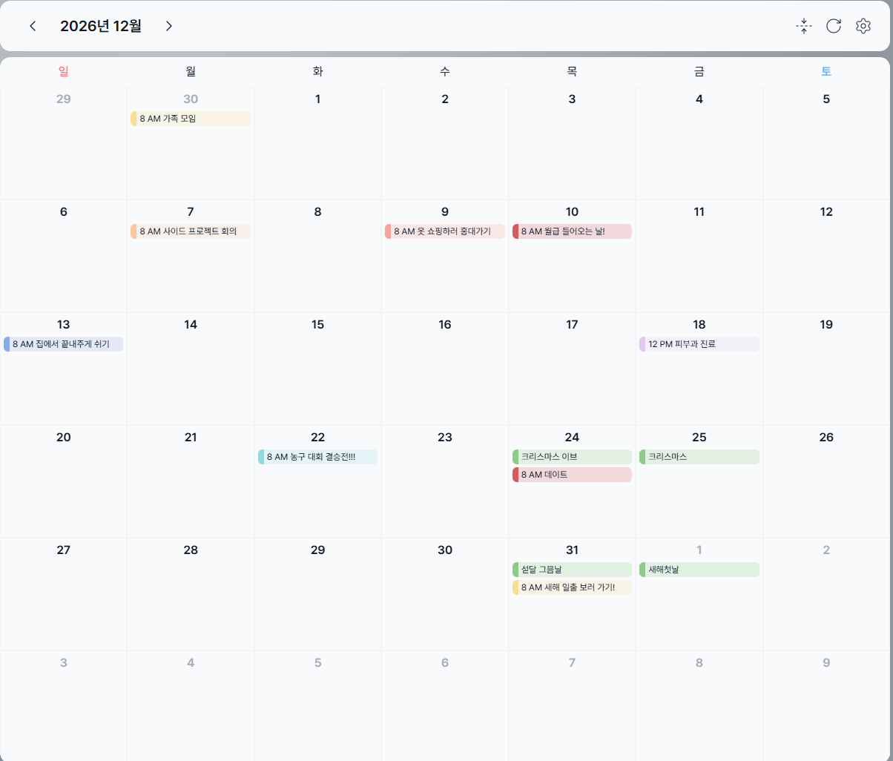
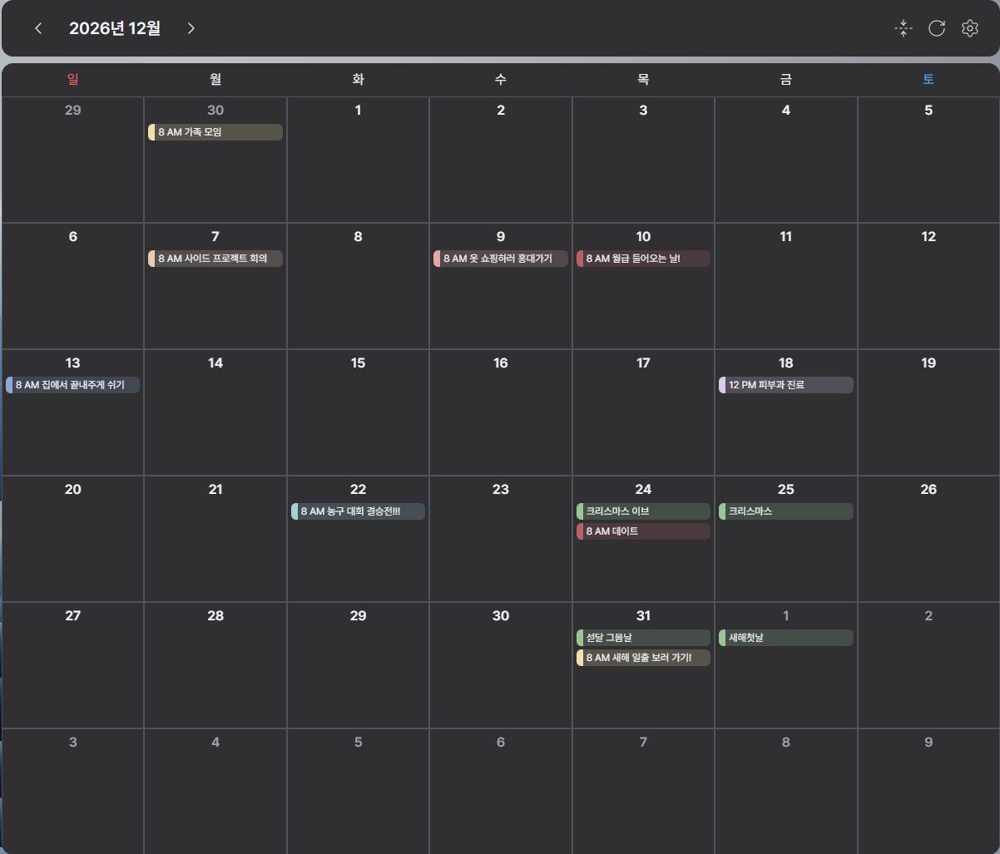

<div align="center">

<br/>

# 데스크톱 캘린더 미리내(Mirinae)

<br/>
<div align="center">
  <a href="https://www.mirinaecalendar.store/">🌐 다운로드 페이지</a>
  &nbsp;&nbsp;·&nbsp;&nbsp;
  🖥️ Windows 지원
</div>
<br/>


<br/>

</div>

---

## 미리내?

> _"캘린더를 켜야 내 일정을 볼 수 있다는 게 조금 불편하지 않으세요?"_

미리내는 그 불편함에서 출발했습니다.  
바탕화면에서 바로바로 일정을 확인하고 관리 할 수 있습니다.

<br/>

## 스크린샷

<div align="center">

|           라이트 모드           |          다크 모드           |
| :-----------------------------: | :--------------------------: |
|  |  |

<!-- 데모 GIF가 있다면 아래 주석을 해제하고 경로를 교체하세요 -->
<!--  -->

</div>

<br/>

## 주요 기능

### 📅 구글 캘린더 연동

구글 계정과 연동해 실시간으로 일정을 불러오고 관리합니다.  
이미 쓰던 캘린더, 이어서 쓰세요.

### 🖱️ 자유로운 위젯 배치

드래그 앤 드롭으로 원하는 위치에 놓고, 투명도도 자유롭게 조절할 수 있어요.  
바탕화면과 자연스럽게 어우러지도록 해보세요.

### 🌙 다크 모드

눈이 편안한 다크 모드를 지원합니다.

### 📝 간편한 일정 관리

일정 추가, 수정, 삭제할 수 있습니다.
완료한 일정은 체크해서 깔끔하게 정리하세요.

### 🔄 자동 업데이트

새 버전이 나오면 알아서 업데이트합니다.

### 🗣️ 문의 하기

앱 내 '문의하기'로 버그 제보나 기능 제안을 보내주시면 적극 반영합니다.

<br/>

## 기술 스택

<table>
  <tr>
    <td><b>Core</b></td>
    <td>Electron · Vite · React · TypeScript</td>
  </tr>
  <tr>
    <td><b>Styling</b></td>
    <td>Tailwind CSS · Radix UI · Lucide React</td>
  </tr>
  <tr>
    <td><b>State & Data</b></td>
    <td>TanStack Query · Electron Store</td>
  </tr>
  <tr>
    <td><b>Architecture</b></td>
    <td>FSD (Feature-Sliced Design)</td>
  </tr>
</table>

<br/>

## 📂 프로젝트 구조

`src/renderer` 폴더는 **FSD(Feature-Sliced Design)** 를 따릅니다.

```
src/renderer/
├── app/        # 전역 설정, Provider, 라우팅
├── pages/      # 페이지 단위 컴포넌트 조합
├── widgets/    # 독립 기능 UI 블록 (Calendar, Header …)
├── features/   # 비즈니스 로직 기능 단위 (Login, AddEvent, DarkMode …)
├── entities/   # 비즈니스 모델 및 UI (User, Event …)
└── shared/     # 공통 컴포넌트, 유틸리티, 상수
```
