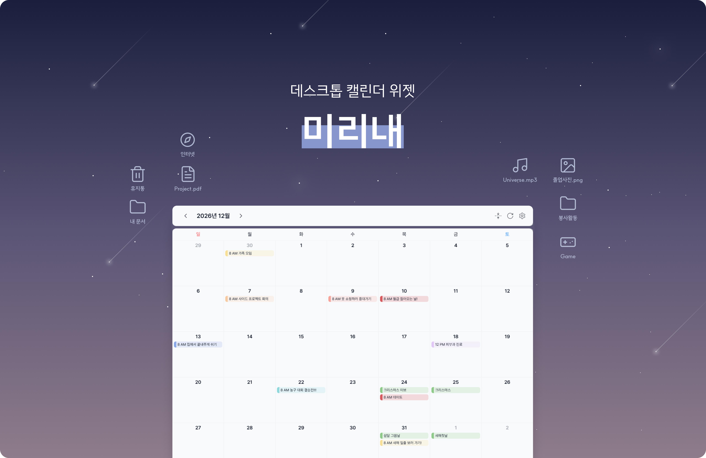
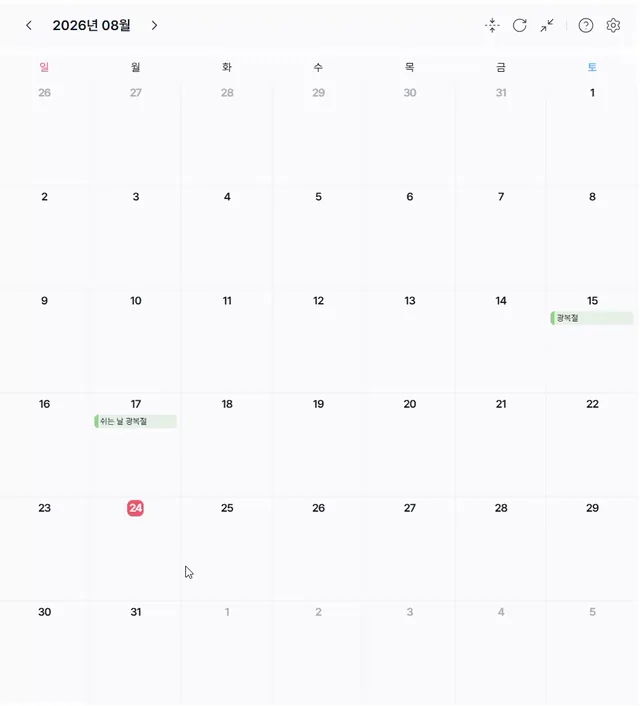
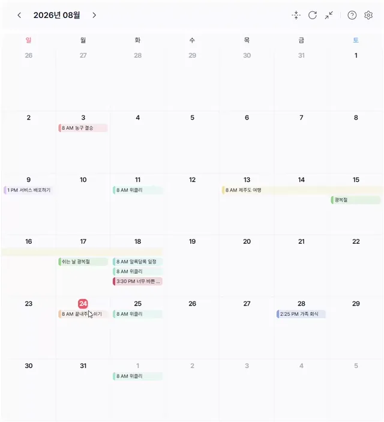
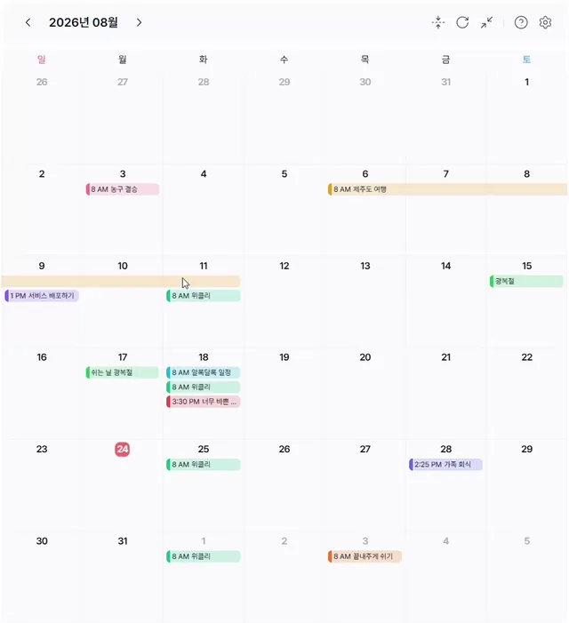
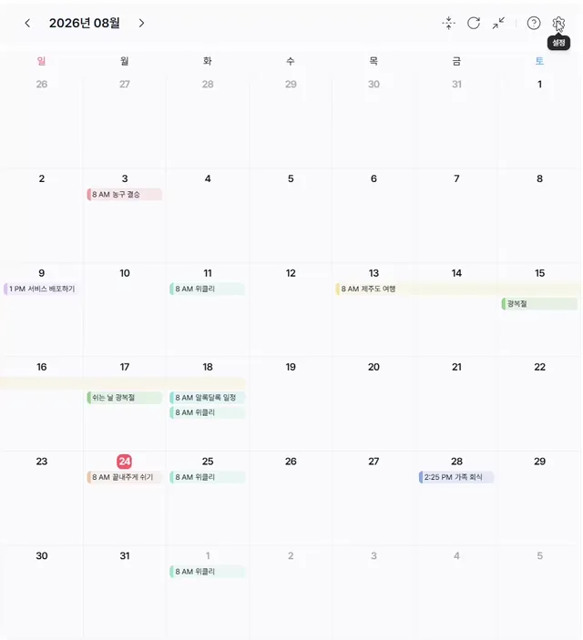
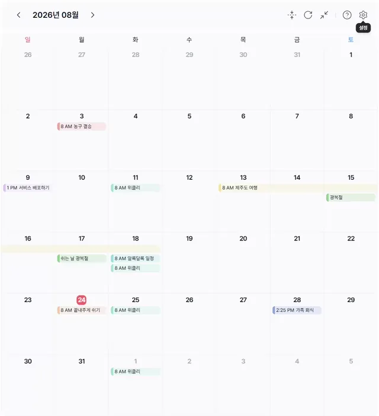
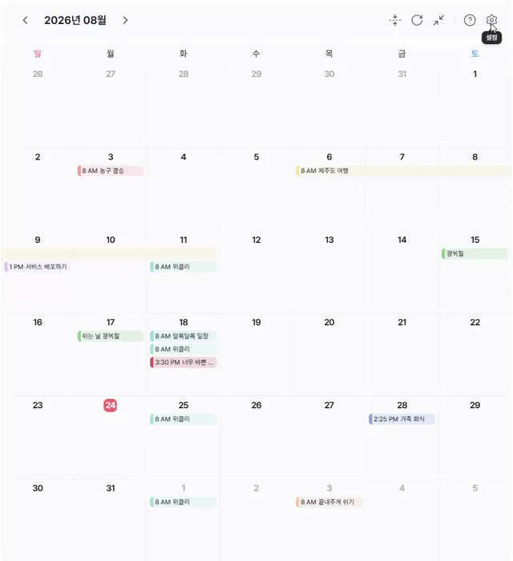
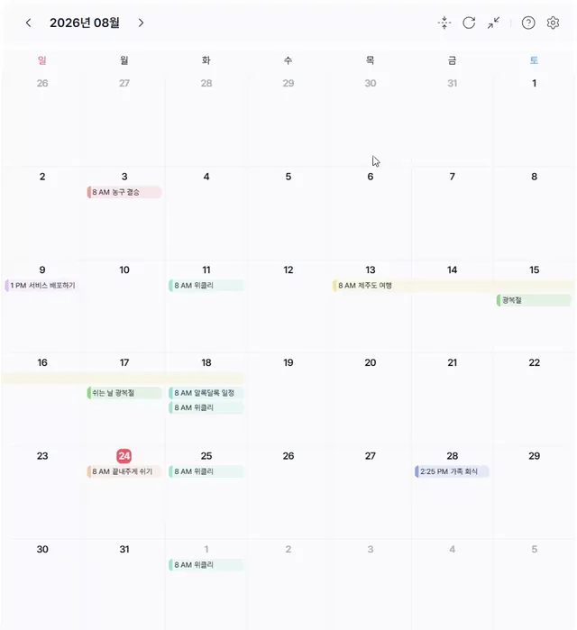
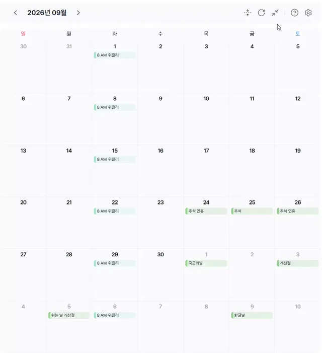

# 미리내 Mirinae

**바탕화면에 붙어 있는 캘린더 위젯** 
앱을 열지 않아도, 바탕화면을 보는 순간 일정이 보입니다.

 

### [⬇️ 다운로드](https://www.mirinae.today/) &nbsp;·&nbsp; [📖 기능 안내](https://www.mirinae.today/docs)

 

## 왜 미리내?

> _"캘린더를 켜야 내 일정을 볼 수 있다는 게 조금 불편하지 않으세요?"_

미리내는 창이 아니라 **바탕화면에 직접 붙는** 캘린더입니다. 
다른 창에 가려지지 않고, 작업표시줄도 차지하지 않아요. 이미 쓰고 있는 **구글 캘린더**를 그대로 불러옵니다.

 

## 주요 기능

<table>
  <tr>
    <td width="50%" valign="top">
      <h3>📝 일정 추가</h3>
      
날짜를 클릭하고 제목, 시간, 색상만 정하면 끝. 복잡한 메뉴 없이 바로 등록할 수 있어요.

      
    </td>
    <td width="50%" valign="top">
      <h3>🖱️ 드래그로 옮기기</h3>
      
일정을 끌어서 원하는 날짜에 놓으면 이동 완료. 다시 입력할 필요가 없어요.

      
    </td>
  </tr>
  <tr>
    <td width="50%" valign="top">
      <h3>↩️ 되돌리기</h3>
      
삭제하거나 옮긴 직후엔 알림에서 바로 되돌릴 수 있어요. 실수로 눌러도 걱정 없어요.

      
    </td>
    <td width="50%" valign="top">
      <h3>📋 일정 요약</h3>
      
오늘 일정, 다가오는 일정, 색상별 일정을 달력 아래에서 한눈에 확인해요.

      
    </td>
  </tr>
  <tr>
    <td width="50%" valign="top">
      <h3>🎯 색상 필터</h3>
      
업무, 개인, 약속처럼 색상으로 나눈 일정 중 원하는 것만 골라 볼 수 있어요.

      
    </td>
    <td width="50%" valign="top">
      <h3>🎨 색상 팔레트</h3>
      
파스텔, 비비드, 톤다운 등 여러 팔레트로 캘린더 전체 색감을 바꿔보세요.

      
    </td>
  </tr>
  <tr>
    <td width="50%" valign="top">
      <h3>🌫️ 투명도 조절</h3>
      
배경화면이 비치는 정도를 직접 조절해 바탕화면에 자연스럽게 녹여내요.

      
    </td>
    <td width="50%" valign="top">
      <h3>🔍 캘린더 축소</h3>
      
공간이 부족할 땐 작은 달력으로 접어두고, 한 번 더 누르면 원래 크기로 돌아와요.

      
    </td>
  </tr>
</table>

이 밖에도 다양한 기능이 있어요. 전체 기능은 [기능 안내 페이지](https://www.mirinae.today/docs)에서 확인하세요.

 

## 설치하기

1. [다운로드 페이지](https://www.mirinae.today/)에서 설치 파일을 받아요.
2. 받은 `mirinae-setup.exe`를 실행해요.
   > **"Windows의 PC 보호" 창이 뜨나요?** `추가 정보` → `실행`을 누르면 설치가 진행돼요.
3. 설치가 끝나면 **구글 계정으로 로그인**하고 바로 사용하면 돼요.

새 버전이 나오면 앱이 알아서 업데이트해요.

 

## 사용 팁

| 이럴 땐                             | 이렇게 해보세요                                                                                                                   |
| ----------------------------------- | --------------------------------------------------------------------------------------------------------------------------------- |
| 캘린더 위치·크기를 바꾸고 싶어요    | 오른쪽 위 ⚙️ 설정 → **화면조절 시작** → 캘린더를 끌어 옮기고, 점선을 끌어 크기 조절 → **완료**                                    |
| 캘린더가 화면 밖으로 사라졌어요     | 작업표시줄 트레이의 미리내 아이콘 우클릭 → **위치 초기화**                                                                        |
| PC를 켤 때 자동으로 실행하고 싶어요 | 트레이 아이콘 우클릭 → **시작 설정** → **로그인 시 미리내 실행**                                                                  |
| 키보드로 빠르게 추가하고 싶어요     | `Ctrl` + `Enter`로 일정 추가 창을 열고, 입력 후 다시 `Ctrl` + `Enter`로 저장해요. 입력 중 `Ctrl` + `D`는 종일 일정 켜기/끄기예요. |
| 미리내를 끄고 싶어요                | 트레이 아이콘 우클릭 → **미리내 종료**                                                                                            |

 

## 자주 묻는 질문

**Q. 무료인가요?** 
네, 모든 기능을 무료로 쓸 수 있어요.

**Q. 어떤 운영체제를 지원하나요?** 
지금은 Windows 10 이상을 지원해요. macOS 지원도 준비하고 있어요.

**Q. 일정 데이터는 어디에 저장되나요?** 
모든 일정은 내 구글 캘린더에 저장되고, 미리내는 그 일정을 불러와 보여줄 뿐이에요. 따로 서버에 일정을 저장하지 않아요.

**Q. 인터넷 연결이 필요한가요?** 
네, 구글 캘린더와 동기화하려면 인터넷 연결이 필요해요.

 

버그 제보나 기능 제안은 앱 설정의 **문의하기** 또는 [홈페이지](https://www.mirinae.today/)로 보내주세요 💌

